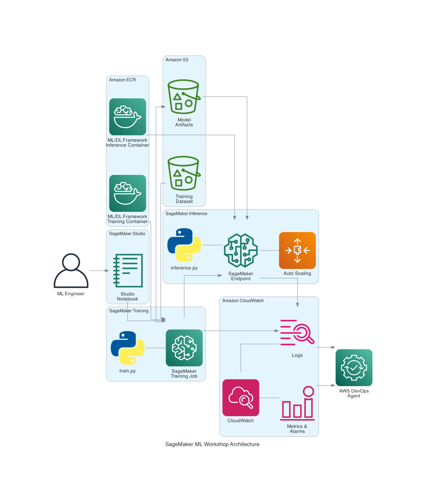
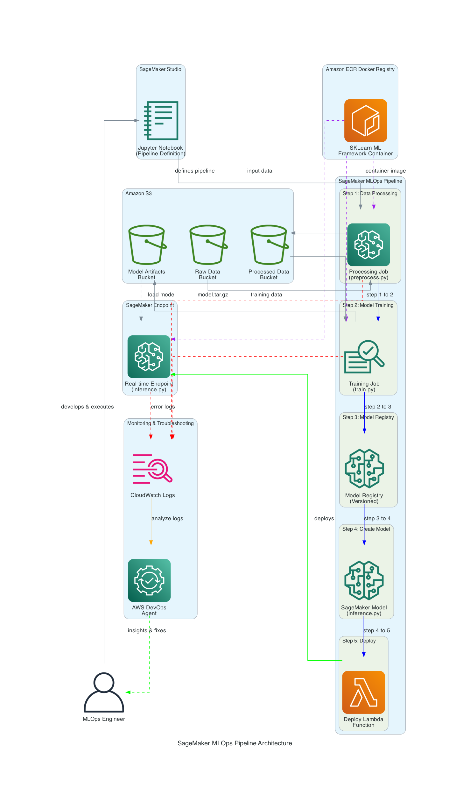

# SageMaker DevOps Agent Troubleshooting Workshop

## ⚠️ Important Security Notice

**This workshop intentionally introduces misconfigurations and bugs for educational purposes to demonstrate AWS DevOps Agent capabilities. The scenarios are designed for non-production, test environments only.**

### Security Best Practices Disclaimer

This workshop does **NOT** follow all AWS security best practices by design, as it demonstrates troubleshooting scenarios. For production deployments, customers must adhere to:

- **[AWS Security Best Practices](https://docs.aws.amazon.com/security)** - Comprehensive security guidance for AWS services
- **[Amazon SageMaker Security Documentation](https://docs.aws.amazon.com/sagemaker/latest/dg/security.html)** - SageMaker-specific security configuration
- **[AWS Shared Responsibility Model](https://aws.amazon.com/compliance/shared-responsibility-model/)** - Understanding security responsibilities
- **[Data Protection in Amazon SageMaker](https://docs.aws.amazon.com/sagemaker/latest/dg/data-protection.html)** - Data encryption and protection measures
- **[IAM Best Practices](https://docs.aws.amazon.com/IAM/latest/UserGuide/best-practices.html)** - Identity and access management guidelines

### Key Security Considerations for Production

When deploying SageMaker workloads in production environments, ensure you:

1. **Implement least privilege access** - Use IAM roles with minimal required permissions
2. **Enable encryption** - Encrypt data at rest and in transit using AWS KMS
3. **Use VPC configurations** - Deploy resources within VPCs with proper network isolation
4. **Enable monitoring and logging** - Configure CloudWatch Logs and CloudTrail for audit trails
5. **Implement multi-factor authentication (MFA)** - Require MFA for sensitive operations
6. **Regular security assessments** - Conduct periodic security reviews and compliance checks
7. **Data protection** - Implement proper data classification and handling procedures
8. **Network security** - Use security groups, NACLs, and VPC endpoints appropriately

**For production deployments, always consult the official [AWS SageMaker Security documentation](https://docs.aws.amazon.com/sagemaker/latest/dg/security.html) and follow the [AWS Well-Architected Framework](https://aws.amazon.com/architecture/well-architected/).**

---

## When AI Meets Operations: Learning with AWS DevOps Agent

An ML engineer receives an alert. Their student course completion prediction model—critical for their education platform serving thousands of students—has encountered issues in production. Students can't get personalized recommendations. The system needs attention.

This workshop demonstrates how AWS DevOps Agent helps investigate and resolve ML operations issues efficiently.

---

## The Challenge: When ML Workflows Break in Production

The company had built a sophisticated ML pipeline on Amazon SageMaker to predict student course completion rates. The system was designed to be robust:
- Automated training pipelines
- Real-time inference endpoints
- Auto-scaling for peak demand

But issues can arise at any time.

**The Reality of ML Operations:**
- Training jobs failing with cryptic KeyError messages
- Inference endpoints showing "Unhealthy" status
- Auto-scaling thrashing between 1 and 100 instances
- CloudWatch logs flooding with thousands of error messages
- Mean Time To Resolution (MTTR) can be significant

The engineer knew the traditional approach: SSH into containers, grep through logs, correlate metrics across multiple dashboards, and hope someone remembers the last time this happened.

**But there's a better way.**

---

## Enter AWS DevOps Agent: Your AI-Powered First Responder

AWS DevOps Agent is not just another monitoring tool. It's an autonomous AI agent that acts as your first responder for production incidents, combining:

- **Always-On Incident Detection**: Continuously monitors CloudWatch metrics, logs, and alarms
- **Intelligent Root Cause Analysis**: Correlates signals across your entire ML workflow
- **Automated Investigation**: Analyzes training scripts, inference code, and infrastructure configurations
- **Contextual Recommendations**: Provides actionable fixes based on AWS best practices

Think of it as having a senior SRE with deep SageMaker expertise available on-demand, who never forgets and learns from every incident.

---

## The Workshop: Four Real-World Scenarios

This hands-on workshop recreates realistic production scenarios. You'll intentionally break a SageMaker workflow in four different ways, then use AWS DevOps Agent to investigate and resolve each issue.

### 🎯 Scenario 1: The Training Job Mystery

**The Incident:**
```
AlgorithmError: KeyError: 'target'
Training job failed
```

**What Happened:**
A well-intentioned code refactoring changed a column name from `completed` to `target` in the data preprocessing pipeline. But the training script still referenced `train_df['completed']`. The error message was buried in CloudWatch Logs among thousands of lines.

**Traditional Approach:** 
- Searching through logs manually
- Reproducing the issue locally
- Identifying the root cause
- Fixing and redeploying
- **Result: Extended downtime and delayed resolution**

**With AWS DevOps Agent:**
- Automatically detected the training job failure
- Analyzed CloudWatch Logs and identified the KeyError
- Correlated with recent code changes
- Provided exact line number and fix recommendation
- **Result: Rapid identification and resolution**

**Business Impact:** Significantly reduced time to resolution + faster recovery

---

### 🎯 Scenario 2: The Unhealthy Endpoint Nightmare

**The Incident:**
```
Endpoint Status: Failed
Health Check: 0/10 passing
Customer-facing API: 503 Service Unavailable
```

**What Happened:**
Two critical bugs in the inference code:
1. Missing `ping()` health check function (SageMaker requirement)
2. Memory leak in the prediction loop (unbounded list growth)

The endpoint deployed successfully but immediately failed health checks. Worse, when it did process requests, memory usage climbed until the container crashed.

**Traditional Approach:**
- Debugging why health checks fail
- Identifying the memory leak with profiling tools
- Testing fixes locally
- Redeploying and validating
- **Result: Extended service disruption**

**With AWS DevOps Agent:**
- Detected endpoint health check failures
- Analyzed inference.py and identified missing ping() function
- Monitored CloudWatch Container Insights metrics
- Flagged memory growth pattern and identified the leak
- Provided code fixes for both issues
- **Result: Quick diagnosis of multiple issues**

**Business Impact:** Substantially reduced downtime + prevented customer impact

---

### 🎯 Scenario 3: The Auto-Scaling Chaos

**The Incident:**
```
Endpoint instances: Oscillating rapidly
CloudWatch Alarms: Flooding with notifications
AWS Bill: Significant projected cost overrun
```

**What Happened:**
Aggressive auto-scaling configuration:
- `TargetValue=10` (way too low for invocations per instance)
- `ScaleOutCooldown=0` (no cooldown period)
- Result: Endpoint scaled up on every request, then immediately scaled down

**Traditional Approach:**
- Understanding the scaling behavior
- Reviewing auto-scaling policies and CloudWatch metrics
- Recalculating appropriate thresholds
- Testing and applying fixes
- **Result: Continued cost overruns during investigation**

**With AWS DevOps Agent:**
- Detected abnormal scaling patterns
- Analyzed auto-scaling configuration
- Compared against AWS best practices
- Recommended optimal TargetValue and cooldown settings
- **Result: Rapid configuration correction**

**Business Impact:** Prevented significant cost overruns + optimized resource utilization

---

### 🎯 Scenario 4: The Pipeline Deployment Failure

**The Incident:**
```
Pipeline Status: Failed
Step: ModelDeployment (Lambda)
Error: ImportError in inference script
Automated ML workflow: Broken
```

**What Happened:**
The team's automated ML pipeline—designed to orchestrate data processing, model training, registration, and deployment—failed at the final Lambda deployment step. The inference script used a deprecated pandas import:
- `from pandas.io.common import StringIO` (removed in newer pandas versions)
- Should be: `from io import StringIO` (standard library)

The pipeline had multiple steps, and the error was buried in Lambda function logs, making it difficult to trace.

**Traditional Approach:**
- Reviewing pipeline execution history
- Checking each step's status and logs
- Analyzing Lambda deployment logs
- Debugging dependency and import issues
- **Result: Extended debugging across multiple services**

**With AWS DevOps Agent:**
- Detected pipeline execution failure
- Traced failure to Lambda deployment step
- Analyzed inference script and identified deprecated import
- Provided the exact fix needed
- Explained pandas version compatibility issue
- **Result: Rapid cross-service diagnosis**

**Business Impact:** Prevented disruption to automated ML workflows + maintained system reliability

---

## The Architecture: How It All Works Together

### Core ML Workflow (Scenarios 1-3)



This architecture shows the foundational ML workflow covering:
- **Scenario 1**: Training Job failures
- **Scenario 2**: Endpoint health and memory issues
- **Scenario 3**: Auto-scaling configuration problems

### ML Pipeline Orchestration (Scenario 4)



This architecture extends the core workflow with automated ML pipelines covering:
- **Scenario 4**: Pipeline deployment failures and dependency issues

**The Complete Data Flow:**

1. **You** develop ML models in SageMaker Studio
2. **Training Jobs** pull containers from ECR and data from S3
3. **Endpoints** serve predictions with auto-scaling
4. **SageMaker Pipelines** orchestrate end-to-end ML workflows (data processing, training, model registration, deployment via Lambda)
5. **CloudWatch** collects all logs, metrics, and alarms
6. **AWS DevOps Agent** continuously analyzes CloudWatch signals
7. **When incidents occur**, the agent automatically investigates and provides actionable insights

---

## The Business Case: Why This Matters

### Before AWS DevOps Agent:
- **MTTR**: Extended incident resolution times
- **Incidents**: Regular ML workflow disruptions
- **Engineer time**: Significant hours spent on manual troubleshooting
- **Cost of downtime**: Business impact from service disruptions
- **Team morale**: Stress from complex troubleshooting

### After AWS DevOps Agent:
- **MTTR**: Dramatically reduced incident resolution times
- **Incidents**: Same frequency, but resolved much faster
- **Engineer time**: Substantial time savings for the team
- **Cost savings**: Reduced downtime and operational costs
- **Team morale**: Engineers can focus on innovation

### Key Benefits:
- **Time savings**: Hundreds of hours recovered annually
- **Cost avoidance**: Substantial reduction in incident-related costs
- **Faster innovation**: Engineers focus on ML development, not firefighting
- **Customer satisfaction**: Improved service reliability and uptime

---

## What You'll Learn in This Workshop

### Part 1: Setup & Foundation
- Deploy a complete SageMaker ML pipeline
- Generate synthetic student course completion data
- Understand the baseline "healthy" state

### Part 2-3: Training Job Failure
- **Break it**: Introduce a KeyError in the training script
- **Detect it**: Watch AWS DevOps Agent identify the failure
- **Fix it**: Apply the recommended solution
- **Learn**: Column name mismatches, data validation, error handling

### Part 4-5: Unhealthy Endpoint
- **Break it**: Deploy inference code with missing health checks and memory leaks
- **Detect it**: See how the agent correlates health check failures with code issues
- **Fix it**: Implement proper health checks and fix memory management
- **Learn**: SageMaker endpoint requirements, container health, memory profiling

### Part 6-7: Auto-Scaling Chaos
- **Break it**: Configure aggressive auto-scaling policies
- **Detect it**: Observe the agent analyzing scaling patterns
- **Fix it**: Apply AWS best practices for auto-scaling
- **Learn**: Scaling metrics, cooldown periods, cost optimization

### Part 8-9: Pipeline Deployment Failure
- **Break it**: Deploy a pipeline with deprecated pandas import in inference script
- **Detect it**: Watch the agent trace through pipeline steps to find the Lambda deployment failure
- **Fix it**: Update the import statement to use standard library
- **Learn**: Pipeline orchestration, dependency management, Lambda deployment debugging, version compatibility

### Part 10: Cleanup
- Properly tear down resources
- Review lessons learned
- Understand cost management

---

## Prerequisites: What You Need

### AWS Account Setup:
- Active AWS account with SageMaker access
- SageMaker Studio domain configured (we provide a CloudFormation template)
- IAM role with permissions for:
  - SageMaker (training jobs, endpoints)
  - S3 (data storage)
  - ECR (container images)
  - CloudWatch (logs and metrics)
  - AWS DevOps Agent (investigations)

### Technical Skills:
- Basic Python programming
- Familiarity with Jupyter notebooks
- Understanding of ML concepts (training, inference)
- AWS console navigation

### Time Commitment:
- **Full workshop**: 2-3 hours
- **Individual scenarios**: 30-45 minutes each
- **Can be completed in multiple sessions**

---

## Getting Started: Your Journey Begins

### Step 1: Environment Setup
Use the provided CloudFormation template to set up SageMaker Studio with default VPC configuration:

```bash
aws cloudformation create-stack \
  --stack-name sagemaker-devops-workshop \
  --template-body file://sagemaker-studio-setup-default-vpc.yaml \
  --capabilities CAPABILITY_IAM
```

### Step 2: Open the Workshop Notebooks
1. Navigate to SageMaker Studio
2. For Scenarios 1-3 (Training, Endpoints, Auto-scaling):
   - Open `SageMakerDevOpsAgentWorkshop.ipynb`
3. For Scenario 4 (ML Pipelines):
   - Open `sagemaker_pipeline_workshop.ipynb`
4. Follow the step-by-step instructions in each notebook

### Step 3: Experience the Scenarios
Each scenario is self-contained with:
- Clear objectives
- Code to execute
- Expected failures
- AWS DevOps Agent investigation
- Resolution steps
- Key takeaways

---

## The Epilogue: Resolution and Learning

All four scenarios were resolved using AWS DevOps Agent in a fraction of the time traditional troubleshooting would have required.

The team was able to present:
- **Root cause analysis** for each scenario
- **Fixes applied** with minimal impact
- **Preventive measures** to avoid recurrence
- **Cost savings** from rapid resolution

More importantly, the team learned that modern DevOps isn't about heroic firefighting. It's about building intelligent systems that detect, analyze, and guide you to solutions—so you can focus on innovation, not troubleshooting.

---

## Additional Resources

### Documentation:
- [AWS DevOps Agent Documentation](https://aws.amazon.com/devops-agent/)
- [SageMaker Training Jobs](https://docs.aws.amazon.com/sagemaker/latest/dg/train-model.html)
- [SageMaker Endpoints](https://docs.aws.amazon.com/sagemaker/latest/dg/deploy-model.html)
- [SageMaker Pipelines](https://docs.aws.amazon.com/sagemaker/latest/dg/pipelines.html)
- [SageMaker Model Registry](https://docs.aws.amazon.com/sagemaker/latest/dg/model-registry.html)
- [SageMaker Auto-Scaling](https://docs.aws.amazon.com/sagemaker/latest/dg/endpoint-auto-scaling.html)
- [CloudWatch Logs for SageMaker](https://docs.aws.amazon.com/sagemaker/latest/dg/logging-cloudwatch.html)
- [Lambda Functions in SageMaker Pipelines](https://docs.aws.amazon.com/sagemaker/latest/dg/build-and-manage-steps.html#step-type-lambda)
- [Python Dependency Management](https://docs.python.org/3/library/io.html)

### Workshop Files:
- `SageMakerDevOpsAgentWorkshop.ipynb` - Main workshop notebook (Scenarios 1-3: Training, Endpoints, Auto-scaling)
- `sagemaker_pipeline_workshop.ipynb` - Pipeline workshop notebook (Scenario 4: ML Pipeline orchestration)
- `sagemaker-studio-setup-default-vpc.yaml` - CloudFormation template for SageMaker Studio setup
- `sagemaker_workshop_architecture.png` - Architecture diagram for Scenarios 1-3
- `sagemaker_pipeline_architecture.png` - Architecture diagram for Scenario 4

### Support:
- AWS Support for technical issues

---

## Start Your Journey

Ready to transform how you handle ML operations issues? Open the notebook and begin your journey from reactive troubleshooting to proactive, AI-powered incident response.

**Remember:** Every issue is an opportunity to learn. Every resolution makes your system stronger. And with AWS DevOps Agent, you have powerful tools to help.

*Let's turn challenges into learning opportunities.*

---
This project is licensed under the MIT No Attribution (MIT-0) License. See the LICENSE file.

**Workshop Version:** 1.0  
**Last Updated:** March 2026  
**Difficulty:** Intermediate  
**Duration:** 2-3 hours  
**Cost:** Minimal AWS resource costs (remember to clean up!)
